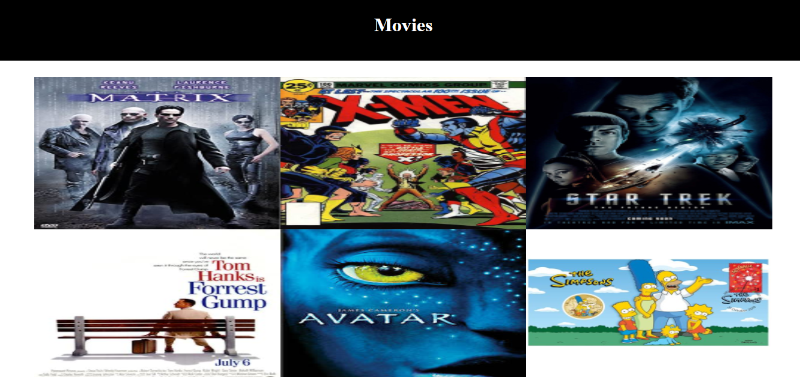
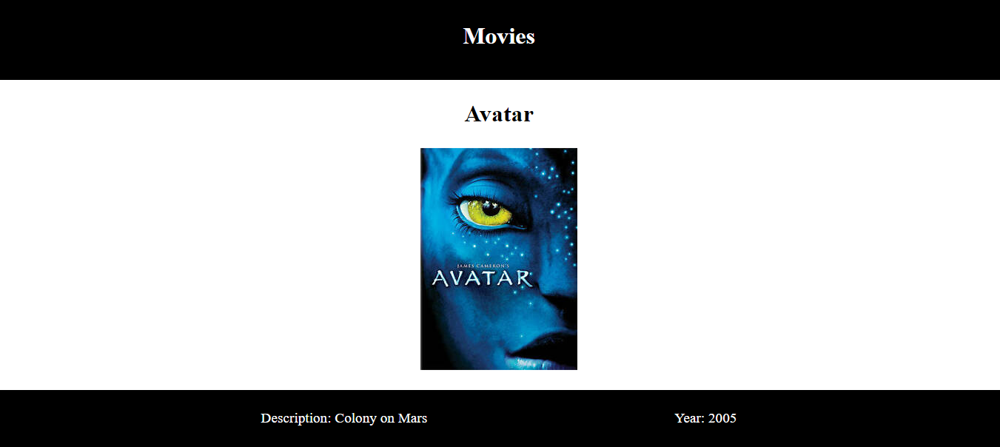

# Movie App

In this project, I used Notion as my backend to display content on my gatsby website.

## Library Directory 📙

| Contents                    |
| --------------------------- |
| [Live Demo](#live-demo)
| [Built With](#built-with-🛠)|
| [Authors](#authors)         |
| [License](#license)         |

## Screenshots

### Main page


#### Description page


## Built With 🛠

```
- Gatsby JS
- Vanilla JS
```

## Live Demo

[Live demo](https://vibrant-benz-7b7600.netlify.app//)

## Getting Started

**To get this project set up on your local machine, follow these simple steps:**

**Step 1**<br>
Navigate through the local folder where you want to clone the repository and run<br>
`git clone https://github.com/NtwaliHeritier/movieApp`.<br>
**Step 2**<br>
Run `cd movieApp`<br>
**Step 3**<br>
Run `npm install` to install the npm packages from the `package.json` file.<br>
**Step 4**<br>
Run `gatsby develop` to start the webpack server, you can now navigate to `http://localhost:8000` to view the app. The server refreshes the app every time you make a change to a file used by it.<br>
**Step 5**<br>
Most important, enjoy the app!<br>

## Authors

### 👨‍💻 NTWALI Heritier

[](https://github.com/NtwaliHeritier) <br>
[](https://www.linkedin.com/in/ntwaliheritier/) <br>
[](mailto:ntwalihatsor78.nh@gmail.com) <br>
[](https://twitter.com/NtwaliHeritier)

### 🤝 Contributing

Contributions, issues and feature requests are welcome!

### Show your support

Give a ⭐️ if you like this project!

### License


